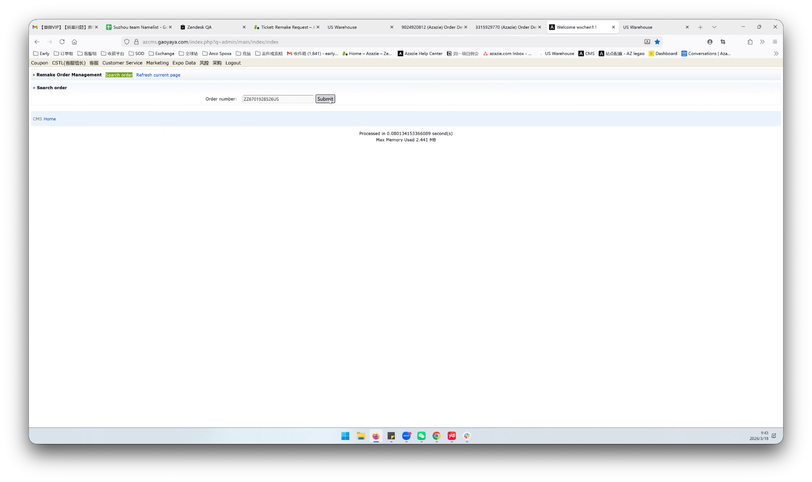
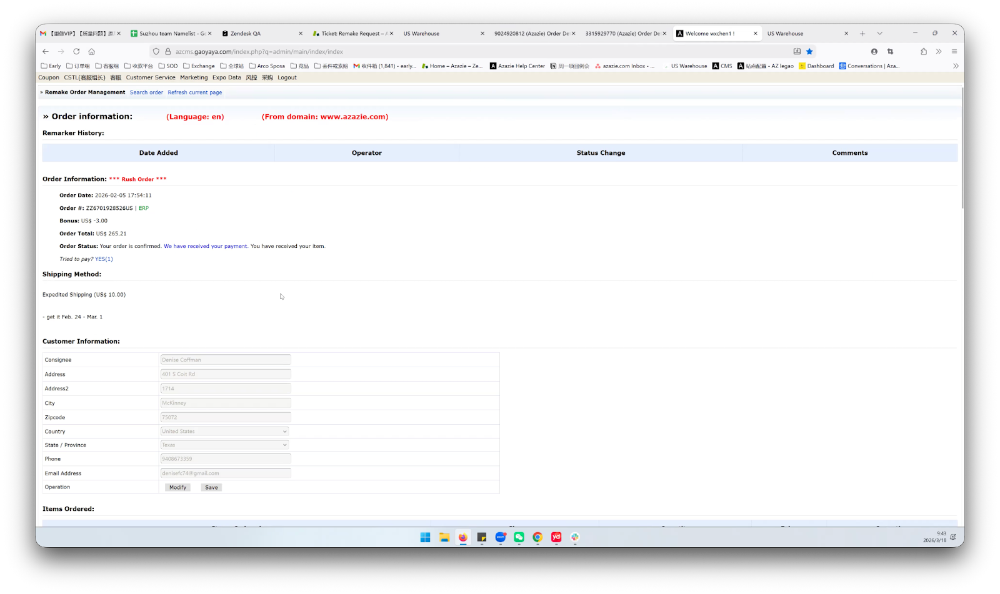
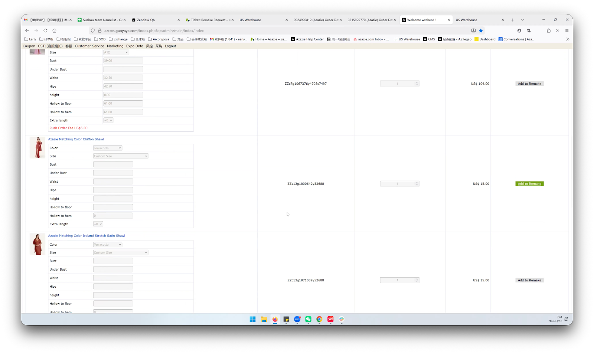
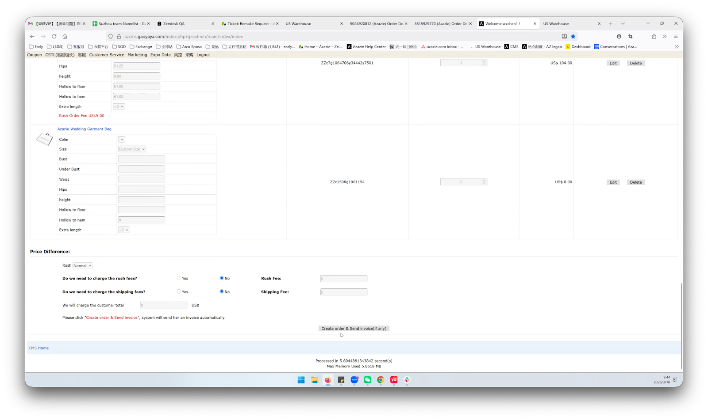
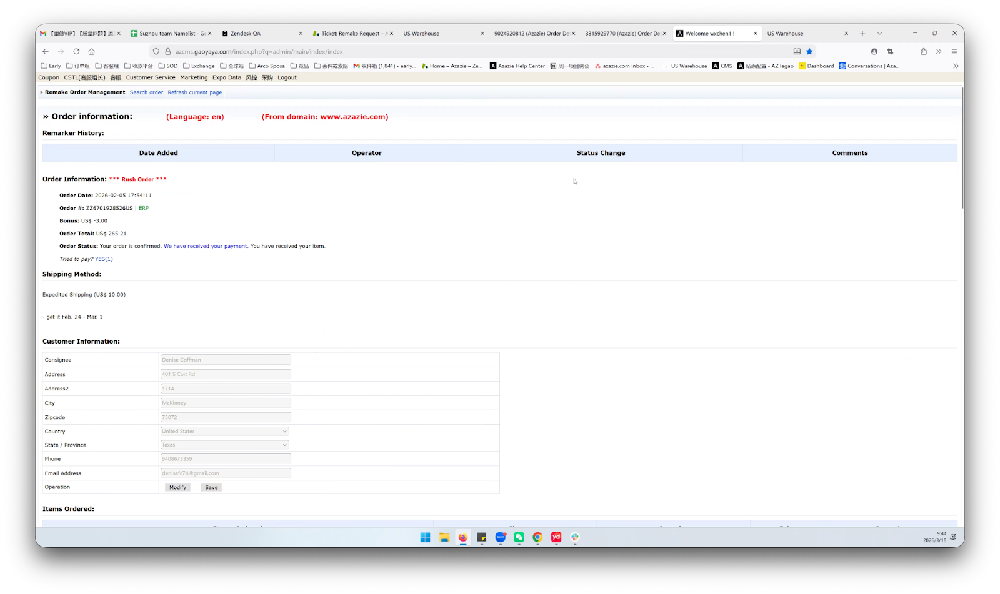

# Remake Step by Step Guide

---

## Standard Remake (Manual Item Selection)

Use this flow when you need to remake **specific items** from an order (e.g., only one item has a quality issue, or the order was split across multiple packages).

### Step 1: Navigate to Remake Order Management

There are two ways to access the Remake page:

1. **Via Customer Service menu:** Go to **Customer Service** > **Order Others** > **Place Remake Order**
2. **Via Order Management:** Go to **Customer Service** > **Order Management**, then find the order and navigate to Remake

.png)

Once on the Remake Order Management page, enter the original order number and click **Submit**.

### Step 2: Review Order & Customer Information

After submitting, the system will display:
- **Order Information** — order number, status, total, shipping method, tracking number
- **Shipping Information** — recipient name, address, phone
- **Customer Information** — name, email, account

You can edit customer information here or in the ERP system.

### Step 3: Select Items to Remake

Scroll down to the **Products Ordered** section. For each item you want to remake, click **"Add to Remake"**.

> **Note:** The system does not support remaking the Azazie wedding garment bag alone (it is a complimentary item).

### Step 4: Create the Remake Order

After adding all desired items, click **"Create Order"**.

The system will ask you to reconfirm:
- Do you want to change the order email?
- Do you want to change the tracking number?
- Do you want to change the customer email?

Review and confirm.

### Step 5: Wait for Order Creation

The system will take approximately **1 minute** to create the remake order.

Once completed, a popup will confirm the remake order has been created. You can find the **new remake order number** in the **Status Change** tab.

### Step 6: Verify in ERP

After the order has synced to ERP, you will see the new remake order in the ERP system, linked to the original order.

---

## Quick Remake (One-Click Full Order Remake)

Use this flow when you need to remake **all available items** from an order — this covers ~80% of cases (typically logistics issues like RTS or lost packages).

### Step 1: Navigate to Remake Order Management

Same as above — go to **Remake** tab > **Remake Order Management**, enter the order number, and click **Submit**.

### Step 2: Click "Remake All"

At the top of the order detail, you'll see the **Quick Remake** section with a **"Remake All"** button. Click it.

### Step 3: Confirm Remake Details

A confirmation dialog will appear showing:
- Original order number
- Number of items to be remade
- Customer email
- Shipping address

Verify the information is correct. If needed, you can change the order email here.

> **Important:** Make sure the customer email is correct and not set to `remake@i9i8.com`. The system will warn you if it detects the default email.

### Step 4: Wait for Order Creation

Same as the standard flow — the system will process for approximately 1 minute, then show a success popup with the new remake order number.

### Step 5: Verify in Status Change

Click **"View in Status Change"** in the success popup, or go to the **Status Change** tab to see the new remake order entry.

---

## Important Notes

| Item | Details |
|------|---------|
| **Garment bags** | Complimentary garment bags cannot be remade alone. They will show as "Unavailable" in the product list. |
| **Customer email** | Always verify the customer email before creating a remake order. The default `remake@i9i8.com` must be changed to the customer's actual email. |
| **Partial remake** | If an order was shipped in multiple packages and only one is lost, use the **Standard Remake** flow to select specific items. |
| **Processing time** | Order creation takes ~1 minute. Do not close the page during processing. |

## Need Help?

- **Domestic CS contact:** Early (for process questions and exception handling)
- **System support:** Contact the tech team via internal ticket
