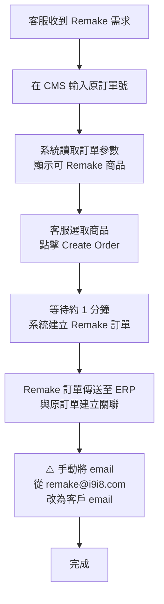
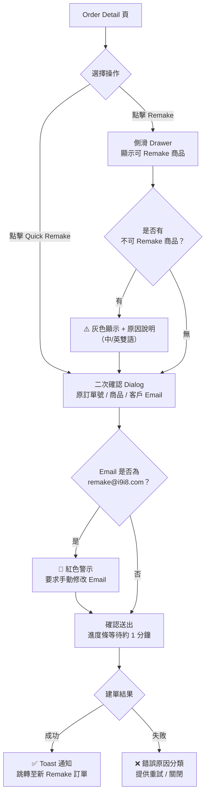

# Remake Task Description

## 1. 背景與目的

目前 Remake 功能存在兩項主要限制：

1. 僅支援特定品類，無法滿足跨品類的 Remake 需求。
2. 僅國內團隊具備使用權限，美國客服團隊無法自行處理 Remake 作業。

本需求目標：

- 放開品類限制，讓 Remake 可支援所有品類（或明確定義例外規則）。
- 擴充並落地美國客服團隊的使用權限。
- 產出 Remake 使用手冊，提供美國客服同事快速上手。
- 評估並提出流程優化方案（例如在 CMS/ERP Order Detail 提供一鍵 Remake）。

## 2. 需求範圍（Scope）

### 2.1 In Scope

- Remake 支援品類限制放開（前後端規則、資料校驗、ERP/CMS 介接限制確認）。
- 權限與角色設計：新增美國客服團隊可用的角色/權限配置與開通流程。
- 針對已知例外情境建立處理策略與提示文案。
- 一鍵 Remake（Quick Remake）方案評估與原型需求（如可行）。

### 2.2 Out of Scope（待確認）

- 客製化資料（照片/刺繡/字母等）全量歷史資料回填/重構（如需大改，另立專案）。
- ERP/CMS 的全面改版與流程重整（僅針對 Remake 入口與操作步驟做最小必要優化）。

## 3. 現況流程（As-Is）

**Remake 原因分佈（來源：Early，國內客服負責人）：**

- 約 **80% 為物流異常**導致：RTS（退回寄件人）或丟包，通常為整單重做
- 約 20% 為其他原因（品質問題等），視情況可能為部分商品 Remake
- 例外：訂單若拆分多包裹發貨，可能只 Remake 其中一包

## 4. 問題與痛點（Problems）

### 4.1 品類/商品限制

- Remake 目前僅支援特定品類，需放開限制。
- 例外情境（已知）：
    - 單獨防塵袋無法 Remake（無購買記錄、屬附贈品）。
    - 自定義配件（例如男士領帶上傳照片）無法讀取歷史訂單照片/刺繡/字母等客製化資料，導致無法 Remake。
    - 特定國家稅號資料不在系統（需釐清是否影響 Remake 下單/出貨/報關）。
    - 訂單拆分多包裹發貨時，只需 Remake 其中一包 → Quick Remake（全選）不適用，需走手動流程選取特定商品。

### 4.2 權限限制

- Remake 功能目前僅國內團隊有權限。
- 與美國客服負責人 Jennifer 確認：
    - 需要此功能的美國同事名單
    - 權限層級（查詢/建立/修改/取消/例外處理等）

### 4.3 效率問題

- 當前流程：輸入訂單號 → 查詢 → 選商品 → add to remake → create order  → 等一分鐘生成訂單。操作步驟多、等待時間長。
- 建議在 CMS 或 ERP 的 Order Detail 頁提供「Quick Remake」按鈕，一鍵完成：建立 Remake 訂單、選取商品、add to remake、送出。

## 5. 目標與成功指標（Goals & Success Metrics）

### 5.1 目標

- G1：Remake 覆蓋所有品類（或有清楚、可維護的例外清單與原因）。
- G2：美國客服在權限開通後可獨立完成 Remake 作業。
- G3：提供可直接交付使用的操作手冊與常見問題處理指引。
- G4：縮短 Remake 建單時間並降低操作步驟。

### 5.2 建議量化指標

- 覆蓋率：可 Remake 的品類/商品比例提升。
- 效率：平均完成 Remake 建單時間下降；平均操作步驟數下降。
- 支援成本：跨區域詢問量/工單量下降。
- 品質：Remake 建單失敗率下降（並能被分類與追蹤原因）。

## 6. 需求說明（To-Be Requirements）

### 6.1 功能需求

1) 放開品類限制

- 系統需支援所有品類的 Remake 入口與可 Remake 商品展示。
- 若遇不可 Remake 情境，需顯示明確原因與建議處理方式（例如改走補寄/人工流程）。

2) 例外處理與提示

- 附贈品（如單獨防塵袋）：
    - 需定義是否允許以替代流程處理（例如補寄），或提供可控的 Remake 類型。
- 自定義配件（照片/刺繡/字母）：
    - 需確認是否可讀取歷史客製化資料；若不可，需提供替代方案（重新上傳/人工下單）並提示。
- 稅號/特定國家欄位：
    - 釐清受影響國家/訂單型態，並定義缺資料時的系統行為（阻擋/允許但提示/要求補填）。

3) 權限與角色

- 新增美國客服可用權限，至少包含：
    - 查詢原訂單並查看可 Remake 商品
    - 建立 Remake 訂單
    
    -（待確認）調整 email 收件者/客戶 email、查看 Remake 與原單關聯、處理例外
    
- 權限開通流程需明確：申請方式、審批人、開通 SLA。

4) 使用手冊

- 面向美國客服的文件，包含：
    - 功能入口與前置條件
    - 標準操作步驟（含截圖/示意）
    - 常見錯誤與排除
    - 例外情境處理
    - 聯絡窗口（國內客服負責人 Early / 系統支援）

5) Quick Remake（選配，視可行性）

- 在 CMS 或 ERP Order Detail 提供 Quick Remake 按鈕：
    - 一鍵完成全單 Remake（以原單參數自動帶入）。
    - 保留原本手動流程以支援部分 Remake。

### 6.2 非功能需求（NFR）

- 權限與審計：重要操作需具備操作紀錄與追蹤能力。
- 可靠性：建立 Remake 訂單流程需可監控（失敗原因可追溯）。
- 可用性：提示文案清晰，降低跨語言/跨團隊誤操作。

## 7. 使用者與權限矩陣（更新：Jennifer 名單）

### 7.1 權限矩陣

[美國客服名單](https://www.notion.so/067c82d8f1ad459ca5828317b2a55921?pvs=21)

### 7.2 權限開通注意事項

- 重要動作（建立 Remake / 修改客戶 email）加入二次確認。
- 全程保留操作審計：操作人、時間、原單/Remake 單號、失敗原因。

## 8. 里程碑與交付物（Milestones & Deliverables）

- M1（需求評審前）：
    - 放開品類限制方案、例外清單與風險整理
    - 權限方案（含 Jennifer 待確認項）
- M2：PRD 定稿（評審結論更新）
- M3：開發 + 測試 + 上線（依排期）
- M4：使用手冊完成並分享給美國客服，完成宣導與培訓

## 9. 依賴與協作（Dependencies）

- Jennifer（美國客服負責人）：名單、角色、權限層級與培訓安排確認。
- Early（國內客服負責人）：現行流程細節、例外情境、驗收協助。
- 研發/ERP/CMS 團隊：
    - 放開品類限制可行性
    - 客製化歷史資料讀取可行性
    - Quick Remake 入口落點（CMS vs ERP）與實作成本

## 10. 風險與對策（Risks & Mitigations）

- R1：品類放開後，ERP/資料限制造成大量失敗
    - 對策：先行盤點不可支援清單；逐步放開；提供清楚失敗原因提示。
- R2：權限外放造成誤操作或資料風險
    - 對策：分級授權、重要操作二次確認、完整審計日誌。
- R3：客製化資料無法讀取，核心需求仍無法覆蓋
    - 對策：建立替代流程並在系統內清楚提示；必要時另立資料整合專案。

## 11. 待確認問題（Open Questions）

1. 哪些品類/商品在 ERP 或資料層面無法 Remake？是否有替代流程？
2. 自定義配件的歷史資料（照片/刺繡/字母）目前儲存位置與可讀取性？
3. 特定國家稅號不在系統的影響面與處理方式？
4. Quick Remake 優先級與落點（CMS vs ERP）？

## 12. 解法與落地方案（Solution）

目標：先讓 Remake 覆蓋上來（放開品類），再讓美國客服可控可用（權限 + 審計），最後Quick Remake + 監控。

### 12.1 放開品類限制：用「可 Remake 規則 + 例外清單」取代硬編碼

- 將現行「僅允許特定品類」改為「預設全開、例外阻擋」。
    - 預設：所有品類可進 Remake 流程
    - 例外：用可配置的規則/清單維護（例如：SKU 類型、是否贈品、是否客製化、是否缺關鍵資料、ERP 限制等）
- 對每個被阻擋的例外情境，提供「清楚原因 + 建議替代流程」
    - 贈品防塵袋：顯示不支援原因，建議走補寄/人工流程
    - 客製化配件（照片/刺繡/字母）：若歷史資料無法讀取，提供重新上傳/人工下單指引
    - 稅號/特定國家欄位缺失：定義缺資料時是阻擋或允許但警告，並列出受影響範圍

### 12.2 權限放開美國客服：角色分級 + 操作審計 + 高風險動作二次確認

- 角色分級（建議）：
    - 最小可用權限：查詢原單、查看可 Remake 商品、建立 Remake 訂單
    - 進階權限（高風險）：處理 exception、修改客戶 email/收件者、取消/重建等
- 開通流程明確化：申請人、核准人、開通 SLA
- 審計日誌（必做）：操作人、時間、原單/Remake 單號、結果（成功/失敗）、失敗原因
- 二次確認（建議）：針對「建立 Remake」「修改客戶 email」等高風險動作

### 12.3 效率提升：Quick Remake（一鍵 Remake）

- **設計前提**：根據 Early 確認，約 80% Remake 為物流異常（RTS/丟包）導致的整單 Remake，Quick Remake 以此為主流場景設計。
- 在 CMS/ERP 的 Order Detail 提供 Quick Remake 按鈕，一鍵完成：
    - 自動帶入原單資訊
    - 自動選取全單所有可 Remake 商品
    - 建單進度可視化（建立中/成功/失敗原因）
- 保留原手動流程作為 fallback：
    - 訂單拆分多包裹、只需 Remake 部分商品時
    - 其他例外情境需個別處理時

### 12.4 Email 預設與校驗：避免 Remake@ 預設造成漏改

- 建議至少做到其一（最好兩者都做）：
    
    1) 建 Remake 時預設就帶原客戶 email（合規與資料完整前提下）
    
    2) 若需技術帳號作為預設，則在送出前強制提示/校驗「客戶 email 未更新」並記錄審計
    

### 12.5 監控與失敗原因分類

- 失敗原因可分類：資料缺失、權限不足、ERP 回寫失敗、客製化資料讀取失敗等
- 追蹤指標：Remake 建單失敗率、Top 失敗原因、平均建單時間、平均操作步驟

### 12.6 建議交付順序

1) 放開品類 + 例外原因提示

2) 美國客服權限 + 審計

3) Quick Remake（效率提升）

## 13. Remake 功能在 CMS 的樣式與互動方案（待評審）

<aside>
🔄

本節為新增方案

</aside>

### 13.1 入口樣式

- **位置**：CMS 客服訂單列表頁與 Order Detail 頁，均提供 Remake 入口。
- **按鈕樣式**：
    - 主色調按鈕（與現有 CMS 設計規範一致），標示「Remake」。
    - Quick Remake 按鈕使用次要樣式，標示「Quick Remake」，置於 Order Detail 頁右上角操作區。
    - 不可 Remake 情境：按鈕置灰（disabled），hover 時顯示 tooltip 說明原因。

### 13.2 & 13.3 操作流程（Remake vs. Quick Remake）

### 13.4 Quick Reference Card 入口

- 在 Order Detail 頁操作區提供 **Quick Reference Card** 連結按鈕（次要樣式，icon + 文字），點擊後開啟使用手冊（新分頁或 side panel）。
- 目的：讓美國客服在操作介面內即可查詢例外情境處理方式與聯絡窗口，無需另行搜尋文件。
- 手冊內容聚焦於：
    - 例外情境處理（不可 Remake 時怎麼辦）
    - Email 校驗提示說明
    - 權限申請流程
    - 聯絡窗口（Early / 系統支援）
- 手冊連結由產品/客服負責人維護，確保內容即時更新。

### 13.4 客戶 Email 校驗互動

- 若建立 Remake 時系統偵測到 email [為預設值（remake@i9i8.com](mailto:為預設值（remake@i9i8.com)），在二次確認 Dialog 中以紅色警示文字提示，要求使用者手動確認或修改。
- 確認後方可送出，並記錄審計日誌。

### 13.5 待確認事項（評審前）

- [ ]  Modal vs. 全頁跳轉：商品選取流程是否適合用側滑 Drawer，或需獨立頁面？
- [ ]  進度條等待時長的 UX 處理方式（是否允許使用者離開頁面後背景繼續建單）？
- [ ]  CMS 設計規範（Design System）版本確認，確保按鈕/顏色/字型一致。
- [ ]  多語系文案（中/英）由誰負責提供與維護？

[Quick Reference Card](https://www.notion.so/Quick-Reference-Card-3a27cfa8cef94d878d947b5557722598?pvs=21)